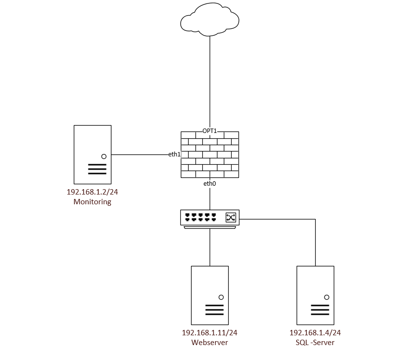

# M300-LB3-HCL

### Inhaltsverzeichnis
* [Team  Übersicht]()
* [Projektbeschrieb]()
* [Ablage Vagrantfiles]()
* [Gliederung]()
* [K1]()
* [K2]()
* [K3]()
* [K4]()
* [K5]()
* [K6]()


## Team Übersicht
* Luca Kiefer
* Haris Chandrakumar
* Cedric Kupper

## Projektbeschrieb
Wir wollen 3 sogennante Container mit der Software Docker in unserem Projekt umsetzen.
Folgenden Services wollte wir in Docker erstellen:

#### Web Container
Einen Container worauf Apache php und Wordpress installiert und kofiguriert ist. 
Das Vagrantfile sollte automatisch Wordpress, PHP und Apache installieren und dies wie folgt einrichten:
* Apache: sollte automatisch Wordpressseite erstellen
* Wordpress: sollte automatisch mit der SQL Datenbank verbunden werden die auf der VM srvsql03 liegt

#### Datenbank Container
Eine Container worauf SQl installiert und konfiguriert ist
Das Vagrantfile sollte automatisch SQL instalieren und folgendes konfigruieren
* Datenbank namens "Wordpress" erstellen
* Wordpress user anlegen und auf Datenbank Wordpress berechtigen

#### Monitoring Container
Ein Container die die anderen Container überwacht.
Alle zur verüfugung gestellten Services sollten mit diesem Container aus Sicherhetisgründen überwacht werden.

## Ablage Dockerfiles
Alle Vagrantfiles findet man [hier](https://github.com/cdrc-kppr/M300-LB3-HCL/tree/master/dockerfiles)


## Gliederung
Unser Markdown ist gemäss LB Anforderungen gegliedert.
Jeder Punkt ist eine LB Anforderung.

## K1

#### VirtualBox
TBZ-Cloudumgebung wird benutz, daher ist Anforderung erfüllt/installiert.

#### Vagrant
TBZ-Cloudumgebung wird benutz, daher ist Anforderung erfüllt/installiert.

#### Visualstudio-Code
TBZ-Cloudumgebung wird benutz, daher ist Anforderung erfüllt/installiert.

#### Git-Client
TBZ-Cloudumgebung wird benutz, daher ist Anforderung erfüllt/installiert.

#### SSH-Key für Client erstellt
1. SSH Key erstellen 

  * Key wird erstellt


  * Namen des Files ermitteln


  * Den Inhalt über Cat aufrufen und den Key Kopieren


  
2. SSH key auf Github hinzufügen

  * Unter SSH keys den kopierten Code einfügen.


## K2
#### GitHub oder Gitlab-Account ist erstellt
Github Accounts wurde von allen 3 Gruppenmitglieder erstellt.
Usernames
* Luca Kiefer - @luca-sk  
* Cedric Kupper - @cdrc-kppr  
* Haris Chandrakumar - @harisc1999

#### Git-Client wurde verwendet
1. SSH key-Link in die Konsole einfügen

  * In der Konsole den den git clone befehl ausführen.


  
  * Mit den richtigen logindaten anmelden.


 * (In der VM Console) Unter Source Controll das Repository Stagen und hinzufügen


#### Dokumentation ist als Mark Down vorhanden
* Siehe [hier](https://github.com/cdrc-kppr/M300-LB3-HCL)


#### Mark down-Editor ausgewählt und eingerichtet
* Siehe [hier](https://github.com/cdrc-kppr/M300-LB3-HCL)

#### Mark down ist strukturiert
* Siehe [hier](https://github.com/cdrc-kppr/M300-LB3-HCL)

#### Persönlicher Wissenstand im Bezug auf die wichtigsten Themen ist dokumentiert (Containerisierung / Docker, Microservices)
##### Luca Kiefer
Mit solchen Services habe ich bisher nur im Azure gearbeitet. Diese Services die man von Microsoft im Azure beziehen kann sind meiner Meinung nach auch Container und sogennant Microservices. 
Gearbeitet habe ich bisher mit folgenden Azure Container/Services: Azuer Active Directory, Azure VPN, Azure Monitoring und einigen mehr.
Ausserhalb von Azure wie zum Beispiel jetzt mit Docker hatte ich noch nie mit Container zu tun

##### Cedric Kupper
Bis jetzt hatte ich noch nicht wirklich mit Container gearbeitet. Ich habe schon davon gehört aber nie genutzt. Das bedeuted ich arbeite in diesem Modul das erste mal effektiv mit Docker und Microservices.

##### Haris Chandrakumar


## K3
#### Bestehenden Docker-Container kombinieren
Luca 


#### Bestehende Container als Backend, Desktop-App als Frontend  einsetzen
Cedric

#### Volumes zur persistenten Datenablage eingerichtet
Cedric

#### Kennt die Docker spezifischen Befehle
Einige wichtige Docker befehle:
Befehl | Funktion
------------ | -------------
docker run | Startet neuer Container
docker ps | Überblick des Containers
docker images | Liste der Images
docker rm | Entfernt Container 
docker rmi | löscht Containerimage
docker start | startet Container
docker stop | stoppr Container 
docker log | Log seit Image


#### Eingerichtete Umgebung ist dokumentiert (Umgebungs-Variablen, Netzwerkplan gezeichnet, Schichtenmodell, Sicherheitsaspekte)

###### Container 
Folgende Container werden erstellt
Docker | Funktion
------------ | -------------
Datenbank | Docker mit MySQL mit der Datenbank Wordpress
Web | Docker mit Apache2 um Wordpressseite bereitzustellen
Monitoring | Docker der die Services Monitort


##### Netzwerkplan - Haris 




##### Sicherheitsaspekte - Haris
Als unsere Sicherheit dient natürlich unsere Firewall und unser Monitoring System. Dank dem Monitoring können wir Sensoren setzen wo wir kontrollieren können wie Ausgelastet unser Server ist und ob bedarf besteht es zu erweitern wie zum Beispiel bei RAM, HDD etc. so können wir früh genug reagieren ohne das es Ausfälle gibt. Bei unserer Firewall sind nur die Ports Offen die benötigt werden um miteinander zu kommunizieren.

###### Monitoring 
Docker von Docker Hub: https://hub.docker.com/_/heartbeat
--> ``` docker pull store/elastic/heartbeat:7.9.1 ```

Docker wurde aufgesetzt um alle Services zu Monitoren
Der Docker prüft alle paar Sekunden ob der Service noch zur Verfügung steht
-> Alles wird auf einer Weboberfläche schön dargestellt

#### Funktionsweise getestet inkl. Dokumentation der Testfälle
##### SQL

Testfall  | Erwartete Aktion |Erfolgreich / nicht erfolgreich
------------ | ------------- | -------------
SQL ist installiert | SQL Konsole verfügbar -> mysql -uroot -p | erfolgreich 
SQL "Wordpress" Datenbank ist verfügbar | SHOW DATABASES ausführen; Wordpress sollte aufgelistet sein |  erfolgreich 
User Wordpress hat Berechtigung auf Wordpress Datebank | SHOW GRANTS FOR 'Wordpress'@'localhost'; Berechtigung auf Wordpress Datanbank | erfolgreich

##### Webserver

Testfall  | Erwartete Aktion |Erfolgreich / nicht erfolgreich
------------ | ------------- | -------------
Apache2 ist installiert | Apche2 Pfad vorhanden (/etc/apache2/) und service kann gestartet werden | erfolgreich
PHP ist installiert | PHP service kann gestartet werden | erfolgreich
Wordpress ist installiert | Wordpress Modul sind vorhanden | erfolgreich
Wordpressseite wurde in apache erstellt | wordpress.conf Ordner ist unter Folgendem Pfad erstellt -> /etc/apache2/sites-available/ und konfiguration ist vorhanden | erfolgreich
Wordpress ist mit Datenbank verbunden | //etc/wordpress/config-localhost.php ist konfigruriet und sql server ist hinterlegt; spich IP: 192.168.1.11 | erfolgreich
Wordpress Standard Seite ist erreichbar | Standardseite wird angezeigt | erfolgreich

Unter der folgender IP 192.168.1.11 erscheint folgende Seite (Wordpress Standardseite) - was heisst die installation war erfolgreich.


## K4
#### Service-Überwachung ist eingerichtet
Siehe Punkt: [Monitoring]()

#### Aktive Benachrichtigung ist eingerichtet
Wird auf Webgui aktiv angezeigt.


#### mind. 3 Aspekte der Container-Absicherung sind berücksichtigt
Cedrc
Haris

#### Sicherheitsmassnahmen sind dokumentiert (Bezug zur eingerichteten Umgebung ist vorhanden)
Haris

#### Projekt mit Git und Markdown dokumentiert
* Siehe [hier](https://github.com/cdrc-kppr/M300-LB3-HCL)

## K5

#### Reflexion
##### Luca Kiefer
Ich konnte Container kennelernen und weiss nun was diese sind und können. Mit dieser Grundlage habe ich dann selber gelernt wie man solche mit Docker erstellt und verwaltet.
Ausserdem habe ich nun auch GitHub besser kennelernen können was meiner Meinung nach eine sehrgute Verwaltungsplattform ist um technische Dokumentationen mit Code etc zu teilen.
Mit Haris und Cedric konnte ich auch sehr gut arbeitet. Die Arbeit haben wir sehr gut unter uns 3 Aufgeteilt und uns gegenseitig geholfen.

##### Cedric Kupper


##### Haris Chandrakumar


## K6
#### Umfangreiche Vernetzung der Container-Infrastruktur (Ansätze für reale Nutzungszenarien)

Unsere 3 Container sind alle mit einander vernetzt und verbunden.
Der Webconrainer hollt sich die Datenbank vom Datenbank container mit den eigenen Credentials. In der Datenbank arbeiet Wordpress.
Ausserdem Überwacht unserer Monitoring Container die andere 2 und gib auf einem Webdashboard auskunft über diese. 

#### Image-Bereitstellung
* Account auf DockerHub gemacht
* DockerHub Account mit GitHub verbunden 
* Repository auf DockerHub erstellt
--> 775577/modul300


#### Continuous Integration
Cedric

#### Cloud-Integration
Luca 
Cedric

#### Elemente aus Kubernetesübung sind dokumentiert


